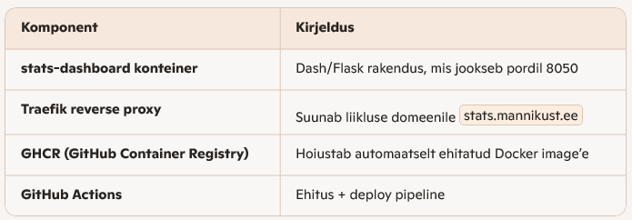
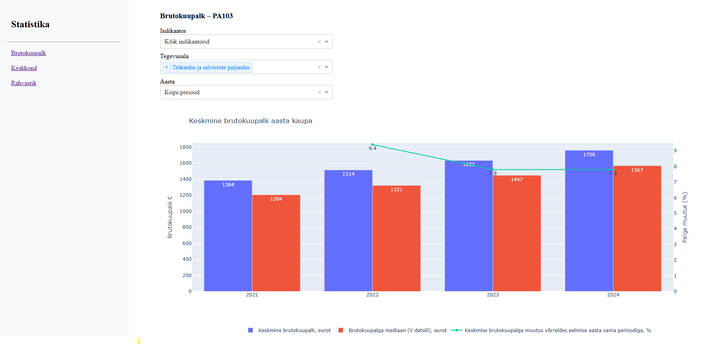

# Stats Dashboard

Interaktiivne **Python Dash** rakendus, mis visualiseerib avalikke statistikaandmeid.  
Projekt on loodud eesmärgiga demonstreerida minu oskust ühendada andmeallikad (API)  
interaktiivseks dashboardiks koos dünaamilise tõlkesüsteemiga.

## Töötav näidis on avalikult kättesaadav:
https://stats.mannikust.ee/economy

## Kasutatud tehnoloogiad
- Python 3.x  
- Dash & Plotly  
- Pandas  
- Requests (API päringud)  
- Docker (rakendus konteineris)
- Traefik (reverse proxy ja HTTPS)
- GitHub Actions + GHCR (CI/CD pipeline)

## Deploy & arhitektuur
Projekt töötab täielikult Docker konteineris.
Iga push GitHubi main harusse käivitab CI/CD pipeline’i, mis:
- ehitab uue Docker image’i
- pushib selle GitHub Container Registry‑sse (GHCR)
- server tõmbab uue image’i ja käivitab konteineri uuesti

Traefik suunab liikluse domeenile:
https://stats.mannikust.ee → stats-dashboard konteiner (port 8050)

#### Arhitektuuri ülevaade
 


## CI/CD (GitHub Actions + GHCR)
Iga kord, kui kood push’itakse GitHubi main harusse:
- GitHub Actions ehitab uue Docker image’i
- Image push’itakse GHCR‑i (ghcr.io/<kasutaja>/<repo>:latest)
- Server tõmbab uue image’i
- Docker Compose käivitab konteineri uuesti
- Traefik suunab liikluse uuele versioonile automaatselt
See tähendab, et deploy on täielikult automatiseeritud — muudatused jõuavad tootmisesse ilma käsitsi sekkumiseta.

## Projekt funktsionaalsus
- Andmete laadimine API -st 
- Dünaamilised graafikud ja tabelid  
- Keelevalik (nt eesti/inglise) koos tõlkesüsteemiga  
- Selge ja modulaarne projekti struktuur (`components/`, `services/`, `utils/`)  

## Arendamiseks lokaalselt
1. Klooni repo:  
```bash
   git clone https://github.com/rannomannikust/stats-dashboard.git
   cd stats-dashboard
```

2. Paigalda sõltuvused:

pip install -r requirements.txt

3. Loo .env fail:

OPENAI_API_KEY=sk-xxxx

4. Käivita rakendus:

python app.py

5. Ava brauseris:

 http://localhost:8050

 

## Käivitamine Dockeriga (lokaalselt)

```bash
docker build -t stats-dashboard .
docker run -p 8050:8050 --env-file .env stats-dashboard
```
